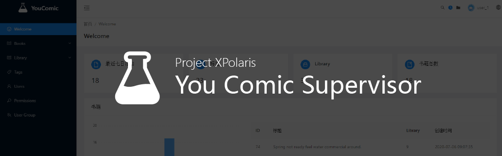

## YouComic Supervisor

   

YouComic Supervisor 是 YouComic 的后台管理工具，提供管理书籍与标签功能。以内容整理为主要内容。提供基于网页的 Web 版本，同时也提供基于 Electron 的桌面版本

### ⚡Feature

- ✒️ 编辑书籍信息
- 🔖 添加标签
- 📚 批量编辑

### 📷Preview

### 🔨 开发

此项目由 Umijs 和 Typescript 完成，支持 electron

#### 目录结构

`src` 前端代码

`config` Umijs 配置文件

`electron` electron 代码

`build` electron 相关配置

#### 编译

- 编译源文件

`yarn build` umijs 会将所有的源文件进行打包

- 生成 Electron

需要三个步骤进行处理：打包前端代码 - 处理 electron - 打包应用 三个步骤

1. `yarn build` 打包前端代码

2. `build:electron:prod` 生成 electron

3. 使用 election-builder 生成对应的平台文件，例如生成 windows portable 版本 `build:win-portable`

更多用法请参见[electron-builder 文档](https://www.electron.build/)

### 🏁TODO

- [x] electron 支持
- [x] 升级到 Umi3
- [ ] 应用翻译
- [ ] 减少 Electron 体积
- [ ] 提供其他平台的版本

### 🔗 链接

- [🏕️YouComic Blog](https://project-xpolaris.github.io/)
- [💻YouComic Studio](https://github.com/Project-XPolaris/YouComic-Studio)
- [💻YouComic Webr](https://github.com/Project-XPolaris/YouComic-Web)
- [🌐YouComic Server](https://github.com/Project-XPolaris/YouComic-Server)
- [📱YouComic Mobile Suit](https://github.com/Project-XPolaris/YouComic-Mobile-Suit)
- [⭐️Project Polaris](https://github.com/Project-XPolaris)
